# BioEmo API Documentation

```mermaid
graph TB
    subgraph Users
        User1["👤 User"]
        User2["👥 Admin"]
    end

    subgraph Actions
        Act1["Login"]
        Act2["View Dashboard"]
        Act3["Manage Users"]
    end

    User1 --> Act1
    User1 --> Act2
    User2 --> Act1
    User2 --> Act2
    User2 --> Act3
```

## SQLite Database Schema

```sql
-- Main database file: biometric.db

-- Users table
CREATE TABLE users (
    id TEXT PRIMARY KEY,
    name TEXT NOT NULL,
    email TEXT UNIQUE NOT NULL,
    department TEXT NOT NULL,
    role TEXT NOT NULL,
    password_hash TEXT NOT NULL,
    face_encoding BLOB,  -- Stored face recognition data
    created_at TIMESTAMP DEFAULT CURRENT_TIMESTAMP,
    last_authenticated TIMESTAMP
);

-- Authentication logs
CREATE TABLE authentication_logs (
    id TEXT PRIMARY KEY,
    user_id TEXT REFERENCES users(id),
    timestamp TIMESTAMP DEFAULT CURRENT_TIMESTAMP,
    success BOOLEAN NOT NULL,
    confidence REAL NOT NULL,
    dominant_emotion TEXT,
    emotion_data JSON,  -- Stores full emotion prediction data
    captured_image BLOB,  -- Stores the image used for authentication
    FOREIGN KEY (user_id) REFERENCES users(id)
);

-- Verification requests
CREATE TABLE verification_requests (
    id TEXT PRIMARY KEY,
    employee_id TEXT NOT NULL,
    reason TEXT NOT NULL,
    additional_notes TEXT,
    captured_image BLOB NOT NULL,
    confidence REAL NOT NULL,
    status TEXT CHECK(status IN ('pending', 'approved', 'rejected')) DEFAULT 'pending',
    submitted_at TIMESTAMP DEFAULT CURRENT_TIMESTAMP,
    reviewed_at TIMESTAMP,
    reviewer_notes TEXT,
    FOREIGN KEY (employee_id) REFERENCES users(id)
);
```

## API Endpoints

### Authentication

#### 1. Face Recognition Authentication
```http
POST /api/auth/face
Content-Type: multipart/form-data

Request:
- image: File (required) - Captured face image

Response:
{
    "success": boolean,
    "confidence": number,  // 0.0 to 1.0
    "message": string,
    "emotions"?: {
        "happiness": number,
        "neutral": number,
        "surprise": number,
        "sadness": number,
        "anger": number,
        "disgust": number,
        "fear": number
    },
    "user"?: {
        "id": string,
        "name": string,
        "email": string,
        "department": string,
        "role": string,
        "joinDate": string,
        "lastAuthenticated": string
    },
    "capturedImage"?: string  // Base64 encoded image
}
```

#### 2. Credential Verification
```http
POST /api/auth/verify
Content-Type: application/json

Request:
{
    "username": string,
    "password": string
}

Response:
{
    "success": boolean,
    "message"?: string,
    "user"?: {
        "id": string,
        "name": string,
        "email": string,
        "department": string,
        "role": string,
        "joinDate": string,
        "lastAuthenticated": string
    }
}
```

### User Management

#### 1. Get Current User
```http
GET /api/users/current
Authorization: Bearer <token>

Response:
{
    "id": string,
    "name": string,
    "email": string,
    "department": string,
    "role": string,
    "joinDate": string,
    "lastAuthenticated": string,
    "emotionHistory": [
        {
            "timestamp": string,
            "success": boolean,
            "confidence": number,
            "emotions"?: {
                "happiness": number,
                "neutral": number,
                "surprise": number,
                "sadness": number,
                "anger": number,
                "disgust": number,
                "fear": number
            }
        }
    ]
}
```

### Analytics

#### 1. Get Authentication Analytics
```http
GET /api/analytics/auth
Authorization: Bearer <token>

Response:
{
    "dailyAuthentications": number,
    "averageConfidence": number,
    "emotionDistribution": {
        "happiness": number,
        "neutral": number,
        "surprise": number,
        "sadness": number,
        "anger": number,
        "disgust": number,
        "fear": number
    }
}
```

#### 2. Get HR Analytics
```http
GET /api/analytics/hr
Authorization: Bearer <token>

Response:
{
    "overallWellbeing": {
        "score": number,
        "trend": "positive" | "negative" | "stable"
    },
    "departmentAnalytics": [
        {
            "department": string,
            "employeeCount": number,
            "averageWellbeing": number,
            "stressLevel": number,
            "dominantEmotion": string
        }
    ],
    "recentEmotionalTrends": [
        {
            "timestamp": string,
            "emotionDistribution": [
                {
                    "emotion": string,
                    "percentage": number
                }
            ]
        }
    ],
    "alerts": [
        {
            "id": string,
            "type": "stress" | "satisfaction" | "wellbeing",
            "severity": "low" | "medium" | "high",
            "department": string,
            "message": string,
            "timestamp": string
        }
    ]
}
```

### Verification Requests

#### 1. Get Verification Requests
```http
GET /api/verification/requests
Authorization: Bearer <token>

Response:
{
    "requests": [
        {
            "id": string,
            "employeeId": string,
            "reason": string,
            "additionalNotes"?: string,
            "capturedImage": string,  // Base64 encoded
            "confidence": number,
            "status": "pending" | "approved" | "rejected",
            "submittedAt": string
        }
    ]
}
```

#### 2. Submit Verification Request
```http
POST /api/verification/requests
Authorization: Bearer <token>
Content-Type: multipart/form-data

Request:
- employeeId: string (required)
- reason: string (required)
- additionalNotes: string (optional)
- capturedImage: File (required)

Response:
{
    "success": boolean,
    "requestId": string
}
```

#### 3. Process Verification Request
```http
PUT /api/verification/requests/:requestId
Authorization: Bearer <token>
Content-Type: application/json

Request:
{
    "action": "approve" | "reject",
    "notes"?: string
}

Response:
{
    "success": boolean,
    "message"?: string,
    "request"?: {
        "id": string,
        "employeeId": string,
        "reason": string,
        "additionalNotes"?: string,
        "capturedImage": string,
        "confidence": number,
        "status": "approved" | "rejected",
        "submittedAt": string,
        "user"?: {
            "id": string,
            "name": string,
            "email": string,
            "department": string,
            "role": string
        },
        "emotions"?: {
            "happiness": number,
            "neutral": number,
            "surprise": number,
            "sadness": number,
            "anger": number,
            "disgust": number,
            "fear": number
        }
    }
}
```

## Error Responses

All endpoints may return the following error responses:

```http
400 Bad Request
{
    "error": string,
    "message": string
}

401 Unauthorized
{
    "error": "unauthorized",
    "message": string
}

403 Forbidden
{
    "error": "forbidden",
    "message": string
}

404 Not Found
{
    "error": "not_found",
    "message": string
}

500 Internal Server Error
{
    "error": "internal_server_error",
    "message": string
}
```

## Authentication

All endpoints except `/api/auth/*` require a valid JWT token in the Authorization header:

```http
Authorization: Bearer <token>
```

The token can be obtained from the successful response of the authentication endpoints.

## Rate Limiting

The API implements rate limiting as follows:
- Authentication endpoints: 5 requests per second per IP
- All other endpoints: 10 requests per second per IP

## Notes

1. All timestamps are in ISO 8601 format
2. All image data is transferred as base64 encoded strings
3. Confidence scores are float values between 0.0 and 1.0
4. Emotion values are float values between 0.0 and 1.0, representing probabilities
5. The SQLite database is used locally on the client side for caching authentication data and temporary storage
6. The database should be encrypted at rest using SQLite encryption extension
7. Regular cleanup of old authentication logs and verification requests should be implemented
8. Implement proper indexing on frequently queried columns for better performance